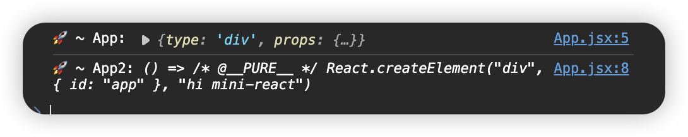

## [01. 实现最简 mini-react](https://github.com/HenryTSZ/mini-react/tree/53e888f05c5f33915fdb06bc7dbbd0e2e0c12856)

## 02. 使用 jsx

我们来将 js 转换为 jsx，借助 `vite`

首先，我们需要使用 `vite` 来创建一个项目：

```bash
pnpm create vite
```

项目名称和框架就用默认的，语言选用 js

然后把我们上节的代码迁移过来

运行后发现报错了：

> Uncaught TypeError: Cannot read properties of null (reading 'appendChild')

这是因为 index.html 中的 id 是 app，改成 root 即可

这样页面就出来了

然后我们把 App.js 改成 App.jsx 试一下

可以正常展示

但现在 App 还是与我们正常写法不同

```js
const App = React.createElement('div', { id: 'app' }, 'hi', ' ', 'mini', '-', 'react')
```

改一下写法：

```js
const App = <div id="app">hi mini-react</div>
```

还是可以正常展示

打印一下 App，发现和我们以前的写法是一致的

看一下内部是如何实现的：

```js
const App2 = () => <div id="app">hi mini-react</div>
console.log('🚀 ~ App2:', App2)
```



其实就是转换成了我们以前的代码

现在还差 main.js 中 App 变成 `<App />` 即可

那还需要将 main.js 改成 main.jsx，当然 index.html 也要改成 main.jsx

页面还是正常展示

那就改一下吧

```js
ReactDOM.createRoot(document.querySelector('#root')).render(<App />)
```

报错了：

> Uncaught ReferenceError: React is not defined

这是因为需要使用 React.createElement 来解析 `<App />`

那我们就引入一下吧

还是报错：

> Uncaught DOMException: Failed to execute 'createElement' on 'Document': The tag name provided ('[object Object]') is not a valid name.

改成 function:

```js
const App = () => <div id="app">hi mini-react</div>
```

还是报错：

> `Uncaught DOMException: Failed to execute 'createElement' on 'Document': The tag name provided ('() => /* @__PURE__ */ React.createElement("div", { id: "app" }, "hi mini-react")') is not a valid name.`

这是因为我们还没有实现 function component 功能，在后面完善，现在还是先用对象形式
