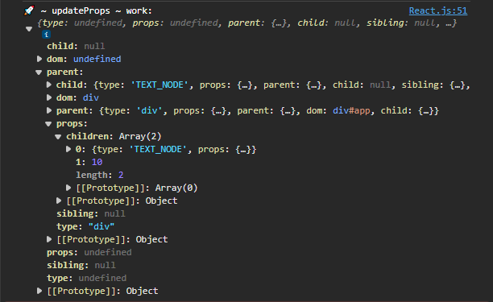
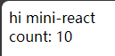
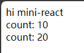

## [01. 实现最简 mini-react](https://github.com/HenryTSZ/mini-react/tree/53e888f05c5f33915fdb06bc7dbbd0e2e0c12856)

## [02. 使用 jsx](https://github.com/HenryTSZ/mini-react/tree/827131b7d45d76c822cb6a655778ed91bf5a2de1)

## [03. 实现任务调度器](https://github.com/HenryTSZ/mini-react/tree/a23c36b7b2a6e8e7ad28a2431c2f98e3208ac546)

## [04. 实现 fiber 架构](https://github.com/HenryTSZ/mini-react/tree/2e11170fffd1a3123ed0c3372c1702c50af22711)

## [04-1. 优化及重构 fiber 架构](https://github.com/HenryTSZ/mini-react/tree/c823e669adaada3f82ab0873f6c302abb2c64e6e)

## [05. 实现统一提交](https://github.com/HenryTSZ/mini-react/tree/15f6a091c103127e0151859c8ebcf14abe7e240e)

## [06. 实现 function component](https://github.com/HenryTSZ/mini-react/tree/d30278ce013910989fe0cc3b964264ec3d7081df)

## 06-1. 实现 function component 后续

上一小节有个致命的问题啊

```js
const Counter = count => <div>count: {count}</div>
```

这个 count 其实是 props: { count: 10 }

所以拿到的一直是一个对象，而不是一个数字

ps: 那对象这种情况其实也是需要处理的，看看后续有处理逻辑没

```js
const Counter = ({ count }) => <div>count: {count}</div>
```

这样拿到的就是一个数字了



就可以在 createElement 中处理了

```js
if (typeof child === 'string' || typeof child === 'number') {
  return createTextNode(child)
}
```

这样就渲染出来了



再加一个：

```js
const App = (
  <div id="app">
    hi mini-react
    <Counter count={10}></Counter>
    <Counter count={20}></Counter>
  </div>
)
```

也没有问题



那我们在 runUnitOfWork 中是不是就不需要处理 function 了呢？

看 log, work.type 是没有 function 了

去掉看看

也没有问题
