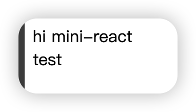

## [01. 实现最简 mini-react](https://github.com/HenryTSZ/mini-react/tree/53e888f05c5f33915fdb06bc7dbbd0e2e0c12856)

## [02. 使用 jsx](https://github.com/HenryTSZ/mini-react/tree/827131b7d45d76c822cb6a655778ed91bf5a2de1)

## [03. 实现任务调度器](https://github.com/HenryTSZ/mini-react/tree/a23c36b7b2a6e8e7ad28a2431c2f98e3208ac546)

## [04. 实现 fiber 架构](https://github.com/HenryTSZ/mini-react/tree/2e11170fffd1a3123ed0c3372c1702c50af22711)

## 04-1. 优化及重构 fiber 架构

上一小节我们实现了 fiber 架构，但其实还是有问题的，我们需要对其进行优化和重构。

### 优化

先看这里：

```js
let prevChild = null
work.props.children.forEach((child, index) => {
  if (!index) {
    work.child = child
  } else {
    child.siblings = prevChild
  }
  child.parent = work
  prevChild = child
})
```

这里应该是

```js
prevChild.siblings = child
```

比如一个父节点有两个子节点，遍历第一个子节点的时候，只给他赋值了 patent，而第二个子节点有 siblings

那返回的时候，第一个子节点没有 child，没有 siblings，那就返回 parent.siblings，第二个子节点就没有渲染了

可以验证一下

```js
const App = (
  <div id="app">
    hi mini-react <div>test</div>
  </div>
)
```

而页面只有 hi mini-react，没有 test


改成

```js
prevChild.siblings = child
```

就出现 text 了



还有就是我们直接给虚拟 dom 添加 parent, siblings 等属性，这样其实不好，应该创建一个新的对象

```js
let prevChild = null
work.props.children.forEach((child, index) => {
  const newWork = {
    type: child.type,
    props: child.props,
    parent: work,
    child: null,
    sibling: null
  }
  if (!index) {
    work.child = newWork
  } else {
    prevChild.sibling = newWork
  }
  prevChild = newWork
})
```

另一个点就是我们在 runUnitOfWork 中判断 work 是否有值

```js
function runUnitOfWork(work) {
  if (!work) return
}
```

但其实有点不好，因为假如现在 work 是 null，那么这次渲染就结束了，应该去执行下次 render 任务了，但我们还是判断的 deadline > 0，所以应该把 work 是否有值加到这里，充分利用空闲时间

```js
while (deadline > 0 && nextWork) {
  // do something
  nextWork = runUnitOfWork(nextWork)
  deadline = IdleDeadline.timeRemaining()
}
```

另外有一点，render 生成的 nextWork 我是这样写的：

```js
const work = {
  ...el,
  parent: {
    dom: container
  }
}
```

而视频中是：

```js
const work = {
  dom: container,
  props: {
    children: [el]
  }
}
```

目前看我这样写也没有问题，这里先记录一下，后续有问题再说，反正崔哥也说了，按自己的想法实现，没问题就行

### 重构

把生成 dom 和 处理 props 的逻辑抽离一下

```js
const createDom = type => {
  type === 'TEXT_NODE' ? document.createTextNode('') : document.createElement(type)
}

const updateProps = (work, dom) => {
  Object.keys(work.props).forEach(key => {
    if (key !== 'children') {
      dom[key] = work.props[key]
    }
  })
}

const initChildren = work => {
  let prevChild = null
  work.props.children.forEach((child, index) => {
    const newWork = {
      type: child.type,
      props: child.props,
      parent: work,
      child: null,
      sibling: null
    }
    if (!index) {
      work.child = newWork
    } else {
      prevChild.sibling = newWork
    }
    prevChild = newWork
  })
}

function runUnitOfWork(work) {
  const dom = (work.dom = createDom(work.type))

  updateProps(work, dom)

  initChildren(work)

  work.parent.dom.appendChild(work.dom)

  if (work.child) {
    return work.child
  }

  if (work.sibling) {
    return work.sibling
  }

  return work.parent?.sibling
}
```
