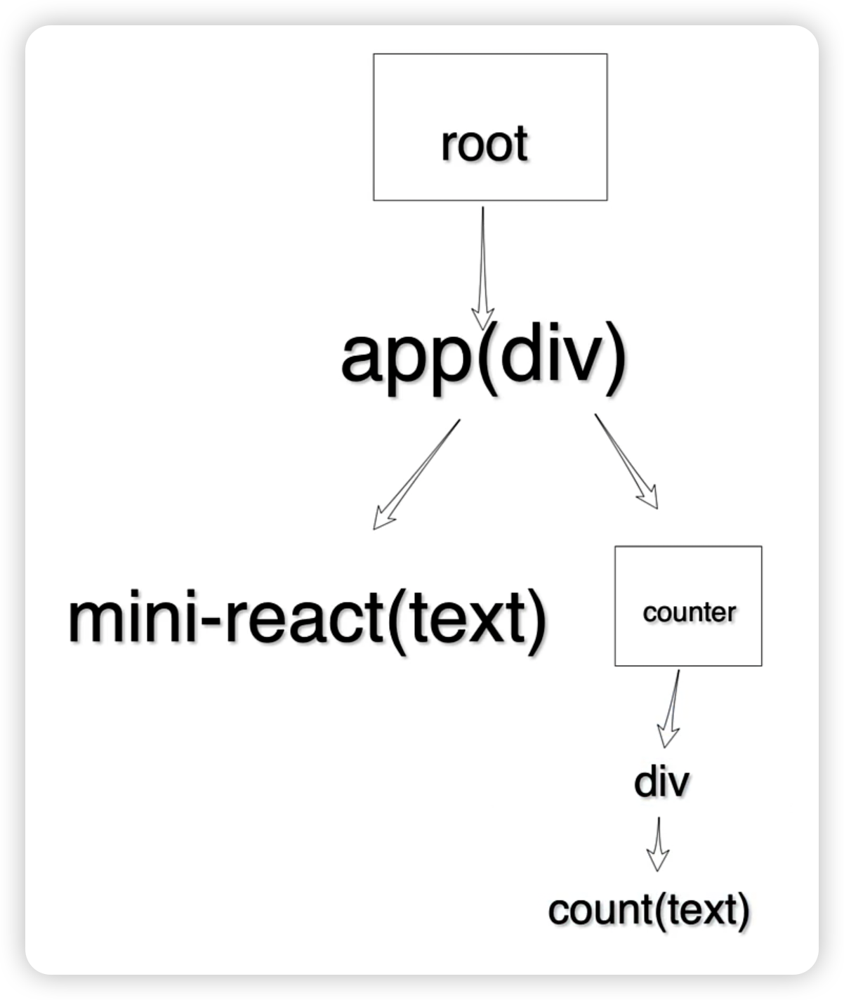
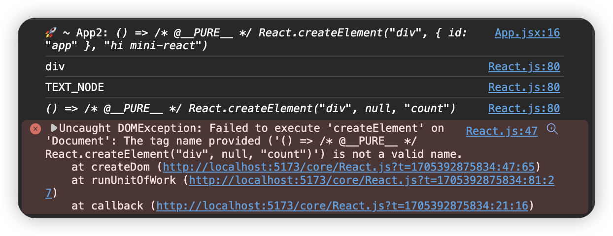
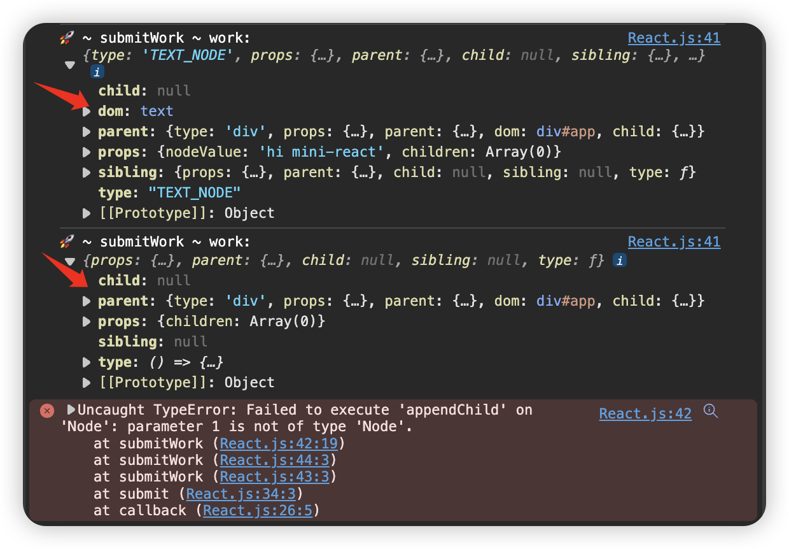
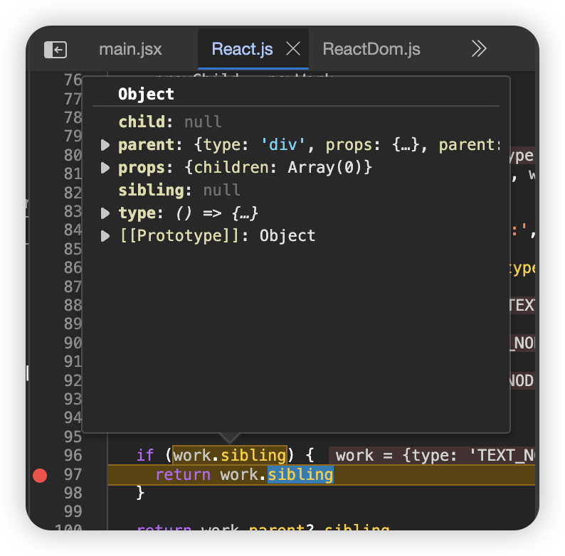
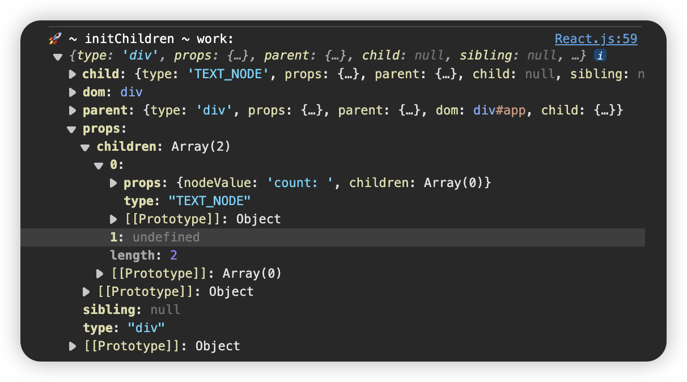
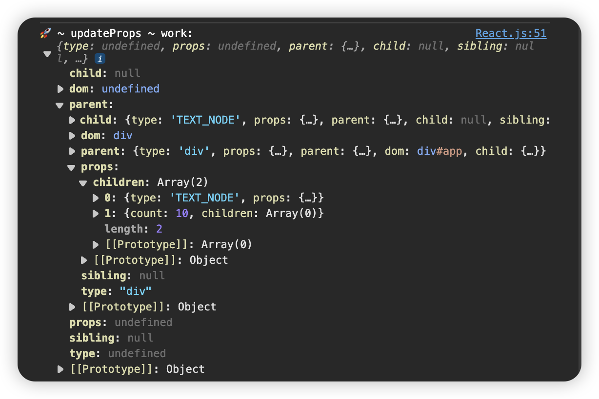
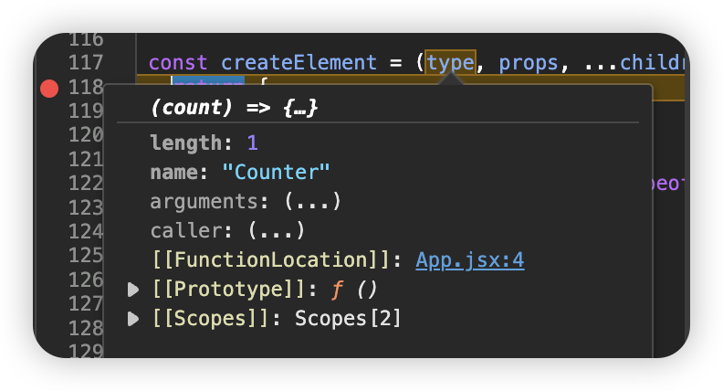
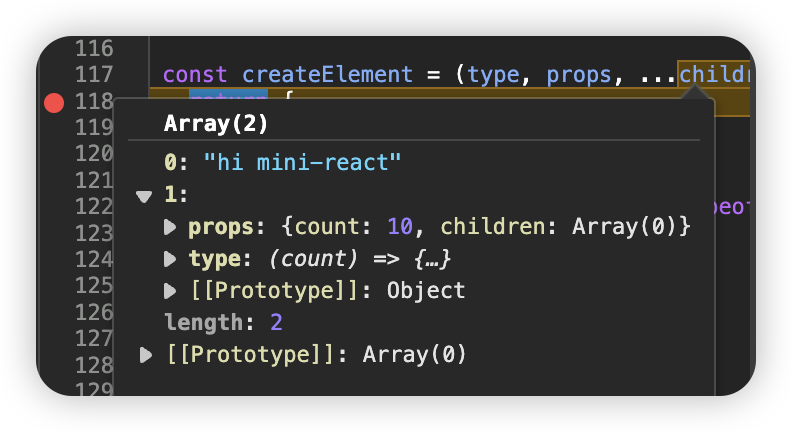
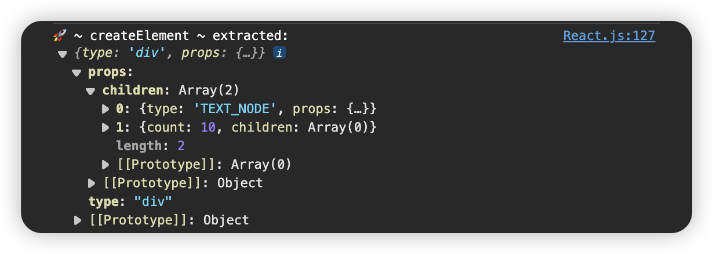

## [01. 实现最简 mini-react](https://github.com/HenryTSZ/mini-react/tree/53e888f05c5f33915fdb06bc7dbbd0e2e0c12856)

## [02. 使用 jsx](https://github.com/HenryTSZ/mini-react/tree/827131b7d45d76c822cb6a655778ed91bf5a2de1)

## [03. 实现任务调度器](https://github.com/HenryTSZ/mini-react/tree/a23c36b7b2a6e8e7ad28a2431c2f98e3208ac546)

## [04. 实现 fiber 架构](https://github.com/HenryTSZ/mini-react/tree/2e11170fffd1a3123ed0c3372c1702c50af22711)

## [04-1. 优化及重构 fiber 架构](https://github.com/HenryTSZ/mini-react/tree/c823e669adaada3f82ab0873f6c302abb2c64e6e)

## [05. 实现统一提交](https://github.com/HenryTSZ/mini-react/tree/15f6a091c103127e0151859c8ebcf14abe7e240e)

## 06. 实现 function component

我们来支持一下 function component

注：以下简称 fc

```js
const Counter = () => <div>count</div>

const App = (
  <div id="app">
    hi mini-react
    <Counter></Counter>
  </div>
)
```

运行后报错了：

> `Uncaught DOMException: Failed to execute 'createElement' on 'Document': The tag name provided ('() => /* @__PURE__ */ React.createElement("div", null, "count")') is not a valid name.`

就是我们现在还不支持 fc

这个是我们现在代码结构：



先来看一下 fc 是啥：

```js
function runUnitOfWork(work) {
  console.log(work.type)
}
```



可以看到第三个 work 是一个 function，而返回值就是一个 ReactElement，所以我们调用一下是不是就可以了？

```js
function runUnitOfWork(work) {
  if (typeof work.type === 'function') {
    work = work.type()
  }
}
```

报错了：

> Uncaught TypeError: Cannot read properties of undefined (reading 'dom')

定位到源码发现上一节的屁股没擦干净啊，在 runUnitOfWork 中这段代码需要去掉的，要不统一提交个啥

```js
work.parent.dom.appendChild(work.dom)
```

删掉再看

还是报错：

> Uncaught TypeError: Failed to execute 'appendChild' on 'Node': parameter 1 is not of type 'Node'.

定位到源码，发现是 submitWork 中的代码报错：

```js
work.parent.dom.appendChild(work.dom)
```

调用了 DOM 节点的 appendChild() 方法，但提供的参数不是 DOM 节点。

那输出一下 work

可以看到报错的 work 是没有 dom 这一属性的



通过调试发现问题出在这里：

```js
if (work.sibling) {
  return work.sibling
}
```



可以看到这里还是把 sibling 直接返回了

但也不对啊，runUnitOfWork 里面处理了啊

哦，这里给重新赋值了，引用关系断了

```js
work = work.type()
```

那就重新赋一下值

```js
if (typeof work.type === 'function') {
  const realWork = work.type()
  for (const key in realWork) {
    if (Object.hasOwnProperty.call(realWork, key)) {
      work[key] = realWork[key]
    }
  }
}
```

页面可以正常展示了

那再试一下传值是否可以

```js
const Counter = count => <div>count: {count}</div>

const App = (
  <div id="app">
    hi mini-react
    <Counter count={10}></Counter>
  </div>
)
```

又报错了：

> Uncaught TypeError: Cannot read properties of undefined (reading 'type')

定位到这里：

```js
const newWork = {
  type: child.type,
  props: child.props,
  parent: work,
  child: null,
  sibling: null
}
```

输出 work 可以看到 children 第二个节点是 undefined



而他的兄弟节点是 `count :`，那这个 undefined 就是代码中 `{count}`

那应该是 count 这个 props 没有传入，就变成 undefined

那就把 props 传入

```js
const realWork = work.type(work.props)
```

又报错了：

> Uncaught TypeError: Cannot convert undefined or null to object

定位到这里：

```js
const updateProps = (work, dom) => {
  Object.keys(work.props).forEach(key => {
    if (key !== 'children') {
      dom[key] = work.props[key]
    }
  })
}
```

输出 work 看看



work.props 是 undefined，但 work 本身看不出来是哪里，通过 parent.props.children 的第二个节点可以看到是那个 {count}，已经被解析成 10 了，问了群里大佬，这个 {count} 解析成 10 是 vite 帮我们做的，这是 jsx 语法自带的

但还有点不对啊，这个和我们的 vdom 有点不一样啊，没有 type

那可能是 createElement 的问题，打断点看看



可以看到一上来就处理 Counter 了，这也没毛病，毕竟这个是先声明的

放过，然后看下一个



这次就是 App 里的 div 了，可以看到有两个 child，其中第二个的 type 是一个 function，那我们调用一下是不是就可以了

同时，如果我们一开始就在这里调用，后面是不是就不需要再调用了呢？

先把这里解决了再说

```js
const createElement = (type, props, ...children) => {
  return {
    type,
    props: {
      ...props,
      children: children.map(child => {
        if (typeof child === 'string') {
          return createTextNode(child)
        } else if (typeof child.type === 'function') {
          return child.type(child.props)
        } else {
          return child
        }
      })
    }
  }
}
```

还是报错

先把 child.type(child.props) 打印出来看看是啥



可以看到这里的第二个 child 就有问题了，可能是 jsx 就解析成这样了？那视频中是如何处理的呢？
