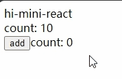
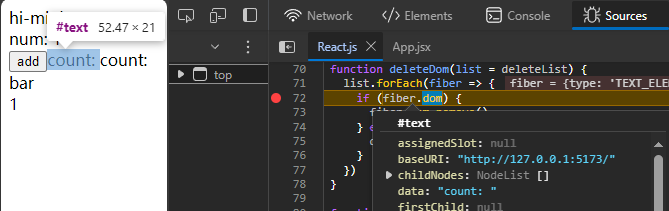

## [01. 实现最简 mini-react](https://github.com/HenryTSZ/mini-react/tree/53e888f05c5f33915fdb06bc7dbbd0e2e0c12856)

## [02. 使用 jsx](https://github.com/HenryTSZ/mini-react/tree/827131b7d45d76c822cb6a655778ed91bf5a2de1)

## [03. 实现任务调度器](https://github.com/HenryTSZ/mini-react/tree/a23c36b7b2a6e8e7ad28a2431c2f98e3208ac546)

## [04. 实现 fiber 架构](https://github.com/HenryTSZ/mini-react/tree/2e11170fffd1a3123ed0c3372c1702c50af22711)

## [04-1. 优化及重构 fiber 架构](https://github.com/HenryTSZ/mini-react/tree/c823e669adaada3f82ab0873f6c302abb2c64e6e)

## [05. 实现统一提交](https://github.com/HenryTSZ/mini-react/tree/15f6a091c103127e0151859c8ebcf14abe7e240e)

## [06. 实现 function component](https://github.com/HenryTSZ/mini-react/tree/d30278ce013910989fe0cc3b964264ec3d7081df)

## [06-1. 实现 function component 后续](https://github.com/HenryTSZ/mini-react/tree/12420c93998cd1d9fe4ca54cb855b8f30d10e9c7)

## [07. 实现事件绑定](https://github.com/HenryTSZ/mini-react/tree/0fafd119d1ee6aac451c5e1cd211803f71e25282)

## [08. 实现更新 props](https://github.com/HenryTSZ/mini-react/tree/6707b972fc5d62d56059fa27eaa3e2aa4915f082)

## [09. 同步视频中的代码](https://github.com/HenryTSZ/mini-react/tree/d9ced68af4c5a0783d5d1af01b568644b739f254)

## [10. diff-更新 children](https://github.com/HenryTSZ/mini-react/tree/93e9c87f642f6d68bad76f7e302700bf17fdb9d4)

## [11. diff-删除多余的老节点](https://github.com/HenryTSZ/mini-react/tree/4d542bf6e2d938b05b273e8579d2df9357403ef4)

## 12. 解决 edge case 的方式

我们看一下用这种方式展示组件

```js
let show = false

return (
  <div {...attribute}>
    hi-mini-react
    <Counter num={10}></Counter>
    <button onClick={handleClick}>add</button>
    count: {count}
    {show && bar}
  </div>
)
```

页面直接报错了：

> Uncaught TypeError: Cannot read properties of undefined (reading 'dom')

这是因为 createElement 中 child 这个节点被渲染为 false 了，show && bar 返回的确实就是 false

所以我们需要处理一下这种情况

我们可以在这里直接过滤掉 child 为 false 的节点，这样就不会报错了

```js
children: children.reduce((acc, child) => {
  if (child === false) {
    return acc
  }
  const isTextNode = typeof child === 'string' || typeof child === 'number'
  return acc.concat(isTextNode ? createTextNode(child) : child)
}, [])
```

这样就没有问题了

那如果调换一下顺序呢：

```js
return (
  <div {...attribute}>
    hi-mini-react
    <Counter num={10}></Counter>
    <button onClick={handleClick}>add</button>
    {show && bar}
    count: {count}
  </div>
)
```

但渲染有点问题，顺序不对了



是不是删除节点有问题，打断点调试一下

由于页面有两个 count:，所以我们修改一处

```js
function Counter({ num }) {
  return <div>num: {num}</div>
}
```



可以看到确实把旧的 count: 删除了，但新的 count: 却在旧的后面

这个其实画图就可以理解了

或者简单说一下，原来的 count: 的 sibling 是 0，

更新后，bar 对应的是旧的 count:，所以把旧的删除了，但新的 count: 就是 bar 的 sibling，对应的就是旧的 0，而且 type 一致，故执行更新了，新的 1 就只能添加了，到了 bar 的后面

所以 {false && 组件} 这种情况，不能简单的这样处理

这个只能自己去 react 源码查看解决方式了
