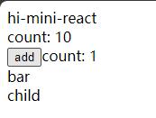

## [01. 实现最简 mini-react](https://github.com/HenryTSZ/mini-react/tree/53e888f05c5f33915fdb06bc7dbbd0e2e0c12856)

## [02. 使用 jsx](https://github.com/HenryTSZ/mini-react/tree/827131b7d45d76c822cb6a655778ed91bf5a2de1)

## [03. 实现任务调度器](https://github.com/HenryTSZ/mini-react/tree/a23c36b7b2a6e8e7ad28a2431c2f98e3208ac546)

## [04. 实现 fiber 架构](https://github.com/HenryTSZ/mini-react/tree/2e11170fffd1a3123ed0c3372c1702c50af22711)

## [04-1. 优化及重构 fiber 架构](https://github.com/HenryTSZ/mini-react/tree/c823e669adaada3f82ab0873f6c302abb2c64e6e)

## [05. 实现统一提交](https://github.com/HenryTSZ/mini-react/tree/15f6a091c103127e0151859c8ebcf14abe7e240e)

## [06. 实现 function component](https://github.com/HenryTSZ/mini-react/tree/d30278ce013910989fe0cc3b964264ec3d7081df)

## [06-1. 实现 function component 后续](https://github.com/HenryTSZ/mini-react/tree/12420c93998cd1d9fe4ca54cb855b8f30d10e9c7)

## [07. 实现事件绑定](https://github.com/HenryTSZ/mini-react/tree/0fafd119d1ee6aac451c5e1cd211803f71e25282)

## [08. 实现更新 props](https://github.com/HenryTSZ/mini-react/tree/6707b972fc5d62d56059fa27eaa3e2aa4915f082)

## [09. 同步视频中的代码](https://github.com/HenryTSZ/mini-react/tree/d9ced68af4c5a0783d5d1af01b568644b739f254)

## [10. diff-更新 children](https://github.com/HenryTSZ/mini-react/tree/93e9c87f642f6d68bad76f7e302700bf17fdb9d4)

## 11. diff-删除多余的老节点

新的节点比旧的短，多出来的需要删除

代码如下

```js
const foo = (
  <div>
    foo
    <div>child</div>
  </div>
)
const bar = <div>bar</div>

return (
  <div {...attribute}>
    hi-mini-react
    <Counter num={10}></Counter>
    <button onClick={handleClick}>add</button>
    count: {count}
    {show ? foo : bar}
  </div>
)
```

可以看到 foo 比 bar 多一个子节点

点击按钮看一下效果：



可以看到 bar 替换了 foo，但 foo 的 child 没有被删除

是因为我们新节点的 children 循环到 bar(对应的旧节点：foo) 就结束了，所以 foo 的 child 没有循环到，所以没有被删除

我们在循环结束还需要判断 oldFiber 是否有值，有值的话还需要再删除

```js
if (oldFiber) {
  deleteList.push(oldFiber)
}
```

这样就没问题了

那如果 foo 还有一个子节点呢：

```js
const foo = (
  <div>
    foo
    <div>child</div>
    <div>child1</div>
  </div>
)
```

和上面情况有点类似，child1 又没有删除掉

所以我们还需要再递归查找 sibling，直到没有 sibling 了

```js
while (oldFiber) {
  deleteList.push(oldFiber)
  oldFiber = oldFiber.sibling
}
```
