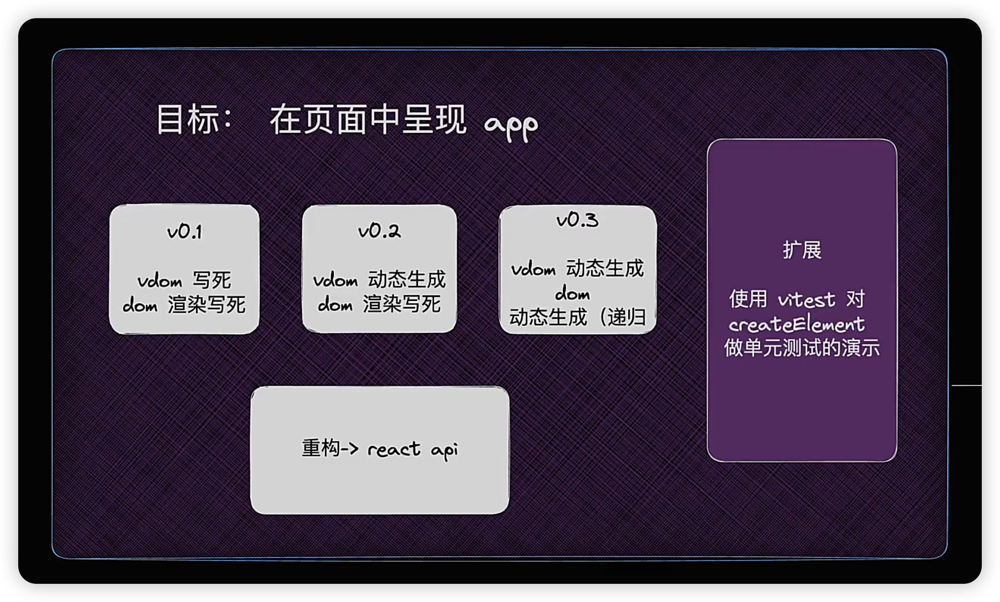
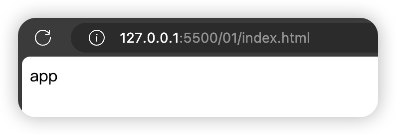

## 01. 实现最简 mini-react

本期目标：在页面呈现 app



### vdom 写死，dom 渲染写死

这个就比较简单了，我们先新建一个 `index.html` 文件，里面有一个 `<div id="root"></div>`，再引入 `main.js`

然后我们就可以实现功能了：

```js
const dom = document.createElement('div')
dom.id = 'app'
document.querySelector('#root').appendChild(dom)

const testNode = document.createTextNode('app')
dom.appendChild(testNode)
```

这样我们在页面中就渲染出 `app` 了



对比视频中的代码：

视频中的是：

```js
const testNode = document.createTextNode('')
testNode.nodeValue = 'app'
```

而我这里没有先创建空文本，再赋值，而且在看视频时，想的是直接设置 `innerHTML`

这样的话，在 render 中就不好实现了

而视频中都是先创建，再设置属性，操作逻辑都一样，就好封装了，所以在以后封装过程中，如果发现不好解决，可以看看是否可以统一逻辑

### vdom 动态生成，dom 渲染写死

第一次看完视频后，到这一步就卡住了，囧，只能重新看一遍

果然是看视频是发现挺简单的，到自己写就都忘完了，没有理解思路，导致步骤是错的

这次引入虚拟 dom

虚拟 dom 就是 js object，根据上面生成 dom 的方法，可以提取出 3 个基本属性：

- `type`: 标签名
- `props`: 属性
- `children`: 子节点

然后上面 dom 的 vdom 就是：

```js
const vdom = {
  type: 'div',
  props: {
    id: 'app',
    children: [
      {
        type: 'TEXT_NODE',
        props: {
          nodeValue: 'app',
          children: []
        }
      }
    ]
  }
}
```

然后开始渲染：

```js
const dom = document.createElement(vdom.type)
dom.id = vdom.props.id
document.querySelector('#root').appendChild(dom)

const testNode = document.createTextNode('')
testNode.nodeValue = vdom.props.children[0].props.nodeValue
dom.appendChild(testNode)
```

我们可以把 `textVDom` 提取出来：

```js
const textVDom = {
  type: 'TEXT_NODE',
  props: {
    nodeValue: 'app',
    children: []
  }
}

const vdom = {
  type: 'div',
  props: {
    id: 'app',
    children: [textVDom]
  }
}

const dom = document.createElement(vdom.type)
dom.id = vdom.props.id
document.querySelector('#root').appendChild(dom)

const testNode = document.createTextNode('')
testNode.nodeValue = textVDom.props.nodeValue
dom.appendChild(testNode)
```

然后根据这两个 vdom 结构来创建动态生成的函数：

```js
const createTextNode = text => {
  return {
    type: 'TEXT_NODE',
    props: {
      nodeValue: text,
      children: []
    }
  }
}

const createElement = (type, props, children) => {
  return {
    type,
    props: {
      ...props,
      children
    }
  }
}
```

调用并渲染一下：

```js
const textVDom = createTextNode('app')
const App = createElement('div', { id: 'app' }, textVDom)

const dom = document.createElement(App.type)
dom.id = App.props.id
document.querySelector('#root').appendChild(dom)

const testNode = document.createTextNode('')
testNode.nodeValue = textVDom.props.nodeValue
dom.appendChild(testNode)
```

可以正常渲染出来

再重构一下

目前 textVDom 还需要我们手动创建，可以将其封装到 `createElement` 中

并且在重构中发现还需要处理多个 children 的情况

```js
const createElement = (type, props, ...children) => {
  return {
    type,
    props: {
      ...props,
      children: children.map(child => (typeof child === 'string' ? createTextNode(child) : child))
    }
  }
}

const App = createElement('div', { id: 'app' }, 'app')

const dom = document.createElement(App.type)
dom.id = App.props.id
document.querySelector('#root').appendChild(dom)

const testNode = document.createTextNode('')
testNode.nodeValue = App.props.children[0].props.nodeValue
dom.appendChild(testNode)
```

这里设置 nodeValue 为 `App.props.children[0].props.nodeValue`，但好像视频中不是这样写的，后续对比一下

视频中是在动态渲染完后再封装的，所以就没有这些代码了

这样 vdom 动态生成就完成了

### vdom 动态生成，dom 动态渲染

接下来就开始动态渲染了

观察一下渲染的过程，都是先 create，然后设置 props，最后 appendChild

我们就封装一个函数实现这个

```js
const render = (el, container) => {
  const dom =
    el.type === 'TEXT_NODE' ? document.createTextNode('') : document.createElement(el.type)

  Object.keys(el.props).forEach(key => {
    if (key !== 'children') {
      dom[key] = el.props[key]
    }
  })

  el.props.children.forEach(child => {
    render(child, dom)
  })

  container.appendChild(dom)
}
```

调用验证一下：

```js
const App = createElement('div', { id: 'app' }, 'hi', ' ', 'mini', '-', 'react')
render(App, document.querySelector('#root'))
```


这样动态渲染就完成了

### 重构成 react api

虽然功能是完成了，但目前和 react api 还不一样，所以我们还需要重构，改成 react api 的形式：

```js
import ReactDOM from 'react-dom/client'
import App from './App.jsx'
ReactDOM.createRoot(document.getElementById('root')).render(<App />)
```

那我们先来创建一个 `ReactDOM` 对象：

有一个 createRoot 方法，接受一个 container 作为参数，返回一个 render 方法，接受一个 element 作为参数

```js
const ReactDOM = {
  createRoot(container) {
    return {
      render(el) {
        render(el, container)
      }
    }
  }
}
```

调用一下：

```js
ReactDOM.createRoot(document.querySelector('#root')).render(App)
```

页面可以正常渲染

那我们就可以拆分了

React.js

```js
const render = (el, container) => {
  const dom =
    el.type === 'TEXT_NODE' ? document.createTextNode('') : document.createElement(el.type)

  Object.keys(el.props).forEach(key => {
    if (key !== 'children') {
      dom[key] = el.props[key]
    }
  })

  el.props.children.forEach(child => {
    render(child, dom)
  })

  container.appendChild(dom)
}

const createTextNode = text => {
  return {
    type: 'TEXT_NODE',
    props: {
      nodeValue: text,
      children: []
    }
  }
}

const createElement = (type, props, ...children) => {
  return {
    type,
    props: {
      ...props,
      children: children.map(child => (typeof child === 'string' ? createTextNode(child) : child))
    }
  }
}

export default {
  render,
  createElement
}
```

ReactDom.js

```js
import React from './React.js'

const ReactDOM = {
  createRoot(container) {
    return {
      render(el) {
        React.render(el, container)
      }
    }
  }
}

export default ReactDOM
```

App.js

```js
import React from './core/React.js'

const App = React.createElement('div', { id: 'app' }, 'hi', ' ', 'mini', '-', 'react')
console.log('🚀 ~ App:', App)

export default App
```

main.js

```js
import ReactDOM from './core/ReactDom.js'
import App from './App.js'

ReactDOM.createRoot(document.querySelector('#root')).render(App)
```

至此，就和 react api 一致了

我们完成了在页面呈现 app，实现了最简的 mini-react
