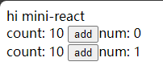
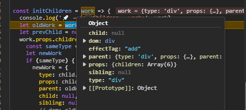
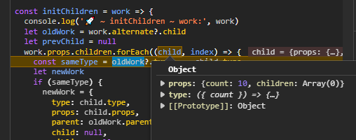

## [01. 实现最简 mini-react](https://github.com/HenryTSZ/mini-react/tree/53e888f05c5f33915fdb06bc7dbbd0e2e0c12856)

## [02. 使用 jsx](https://github.com/HenryTSZ/mini-react/tree/827131b7d45d76c822cb6a655778ed91bf5a2de1)

## [03. 实现任务调度器](https://github.com/HenryTSZ/mini-react/tree/a23c36b7b2a6e8e7ad28a2431c2f98e3208ac546)

## [04. 实现 fiber 架构](https://github.com/HenryTSZ/mini-react/tree/2e11170fffd1a3123ed0c3372c1702c50af22711)

## [04-1. 优化及重构 fiber 架构](https://github.com/HenryTSZ/mini-react/tree/c823e669adaada3f82ab0873f6c302abb2c64e6e)

## [05. 实现统一提交](https://github.com/HenryTSZ/mini-react/tree/15f6a091c103127e0151859c8ebcf14abe7e240e)

## [06. 实现 function component](https://github.com/HenryTSZ/mini-react/tree/d30278ce013910989fe0cc3b964264ec3d7081df)

## [06-1. 实现 function component 后续](https://github.com/HenryTSZ/mini-react/tree/12420c93998cd1d9fe4ca54cb855b8f30d10e9c7)

## [07. 实现事件绑定](https://github.com/HenryTSZ/mini-react/tree/0fafd119d1ee6aac451c5e1cd211803f71e25282)

## 08. 实现更新 props

更新的话需要有新旧节点的比对，然后根据比对结果来判断是否需要更新。

先把更新代码写好

```js
let num = 0
const Counter = ({ count }) => {
  const add = count => {
    console.log(111, count)
    num++
    React.update()
  }

  return (
    <div>
      count: {count} <button onClick={() => add(count)}>add</button>
      num: {num}
    </div>
  )
}
```

老节点的话有一个 rootDom，但挂载完就置空了，所以还需要一个变量

```js
let currentRoot = null
```

在统一提交后赋值

```js
if (!nextWork && rootDom) {
  submit()
  currentRoot = rootDom
  rootDom = null
}
```

然后就可以写更新逻辑了，用 alternate 来存储老节点

```js
const update = () => {
  const work = {
    ...currentRoot,
    parent: {
      dom: currentRoot.parent.dom
    },
    alternate: currentRoot
  }
  nextWork = work
  rootDom = work
}
```

那这样 nextWork 就有 dom 了，在 runUnitOfWork 中处理

```js
let dom = work.dom
if (!dom) {
  dom = work.dom = createDom(work.type)
  updateProps(work, dom)
}
```

首先来处理 children

先拿到老的 child:

```js
let oldWork = work.alternate?.child
```

然后判断 type 是否一致，一致就更新，否则就重新创建

这里要注意，一致的话，newWork 的 parent 是 oldWork 的 parent，同时要把 alternate 添加上

同时添加一个 effectTag，用于区分是 add 还是 update

```js
const sameType = oldWork?.type === child.type
let newWork
if (sameType) {
  newWork = {
    type: child.type,
    props: child.props,
    parent: oldWork.parent,
    child: null,
    sibling: null,
    alternate: oldWork,
    effectTag: 'update'
  }
} else {
  newWork = {
    type: child.type,
    props: child.props,
    parent: work,
    child: null,
    sibling: null,
    effectTag: 'add'
  }
}
```

同时要更新 oldWork，然后把 oldWork 的 sibling 赋值给 oldWork。这里涉及到链表的知识

```js
if (oldWork) {
  oldWork = oldWork.sibling
}
```

然后我们就需要在 submit 中判断到底是 add 还是 update，同时还需要把老的 props 传递进去

```js
if (work.effectTag === 'add') {
  work.parent.dom.appendChild(work.dom)
} else if (work.effectTag === 'update') {
  updateProps(work, work.dom, work.alternate?.props)
}
```

看一下页面，发现什么也没有了，也没有报错，只是没有渲染

这是因为我们的 root 节点没有添加 effectTag

需要在 render 和 update 中添加 effectTag，这样才能正确渲染

先接收一下参数

```js
const updateProps = (work, dom, oldProps = {}) => {}
```

然后开始处理 updateProps

分 3 种情况：

1. old 有，new 没有，删除
2. old 没有，new 有，创建
3. old 有，new 有，更新

下面两种可以一起处理，old 没有就是 undefined，对比不同就更新

先看第一种：

```js
Object.keys(oldProps).forEach(key => {
  if (key !== 'children') {
    if (!(key in props)) {
      dom.removeAttribute(key)
    }
  }
})
```

再看另外两种：

```js
Object.keys(props).forEach(key => {
  if (key !== 'children') {
    if (props[key] !== oldProps[key]) {
      if (key.startsWith('on')) {
        const eventType = key.slice(2).toLowerCase()
        dom.addEventListener(eventType, props[key])
        dom.removeEventListener(eventType, oldProps[key])
      } else {
        dom[key] = props[key]
      }
    }
  }
})
```

页面可以正常展示，但点击后 num 没有更新

debug 调试发现 num 还是 0

就好像函数没有重新调用一样

嗯？想起来了，我们只在 createElement 中调用了一次，相当于只是在 render 阶段调用了，update 阶段没有调用，所以还是用的旧的数据

那还是把 createElement 中的删除，打开 runUnitOfWork

```js
if (typeof work.type === 'function') {
  const realWork = work.type(work.props)
  for (const key in realWork) {
    if (Object.hasOwnProperty.call(realWork, key)) {
      console.log('🚀 ~ runUnitOfWork ~ key:', key, realWork[key])
      work[key] = realWork[key]
    }
  }
}
```

再点击按钮，发现多出来一行



应该是 Counter 组件 diff 不对，变成添加了

那应该是 initChildren 里面的逻辑有问题

debug 发现没有 alternate



那应该是 initChildren 里面的逻辑有问题

debug 发现还有 type 是 function 的



那就还需要处理一下

```js
if (typeof child.type === 'function') {
  const realChild = child.type(child.props)
  for (const key in realChild) {
    if (Object.hasOwnProperty.call(realChild, key)) {
      child[key] = realChild[key]
    }
  }
}
```

点击按钮还是不行

而且 debug 后发现在 initChildren 中链表有问题了，oldWork 和 work 对应不上了，应该是开箱 fc 造成的

这个先这样吧，后续再研究，先学习新知识去了
