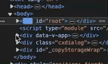

## [01. 实现最简 mini-react](https://github.com/HenryTSZ/mini-react/tree/53e888f05c5f33915fdb06bc7dbbd0e2e0c12856)

## [02. 使用 jsx](https://github.com/HenryTSZ/mini-react/tree/827131b7d45d76c822cb6a655778ed91bf5a2de1)

## [03. 实现任务调度器](https://github.com/HenryTSZ/mini-react/tree/a23c36b7b2a6e8e7ad28a2431c2f98e3208ac546)

## [04. 实现 fiber 架构](https://github.com/HenryTSZ/mini-react/tree/2e11170fffd1a3123ed0c3372c1702c50af22711)

## [04-1. 优化及重构 fiber 架构](https://github.com/HenryTSZ/mini-react/tree/c823e669adaada3f82ab0873f6c302abb2c64e6e)

## 05. 实现统一提交

上一小节重构完了忘记验证了，createDom 没有 return，改一下

```js
const createDom = type =>
  type === 'TEXT_NODE' ? document.createTextNode('') : document.createElement(type)
```

好，正片开始

上一小节实现了当 dom 树太多时，渲染会卡顿的问题，就是利用浏览器空闲时间来做这个事情。

那假如浏览器没有空闲时间呢？渲染到一半停了，等几秒钟才能再渲染

那我们就先构建出 dom 树，再统一提交

就是在没有 nextWork 的时候去处理

```js
if (!nextWork) {
  submit()
}
```

统一提交就需要从根节点开始渲染，这这个根节点就是 render 中的那个 nextWork，并且还需要把他保存起来

```js
let rootDom = null

const render = (el, container) => {
  const work = {
    ...el,
    parent: {
      dom: container
    }
  }
  nextWork = work
  rootDom = work
}
```

```js
function submit() {
  rootDom.parent.dom.appendChild(rootDom.dom)
}
```

还需要处理子节点及兄弟节点，这就需要递归处理了

```js
function submit() {
  submitWork(rootDom)
}

function submitWork(work) {
  if (!work) {
    return
  }
  work.parent.dom.appendChild(work.dom)
  submitWork(work.child)
  submitWork(work.sibling)
}
```

看一下页面没有问题

但看 dom 却是在一直重复添加



所以我们只添加一次就够了

```js
if (!nextWork && rootDom) {
  submit()
  rootDom = null
}
```

这样就完成了统一提交
